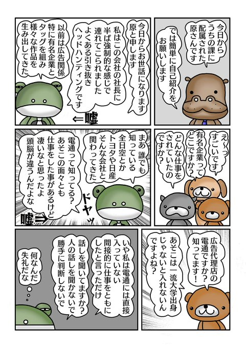
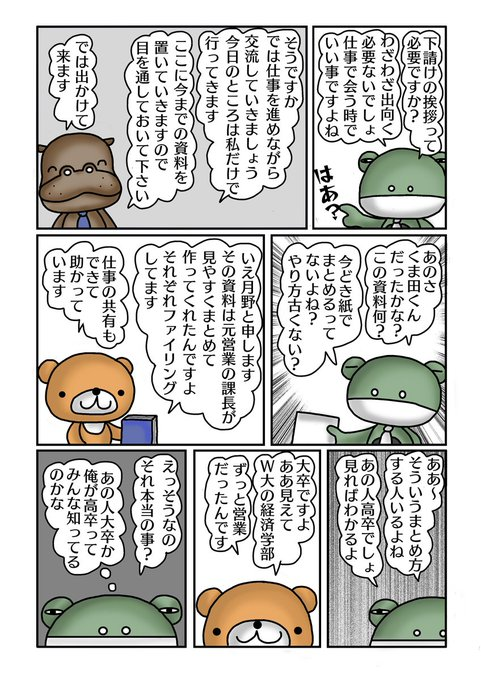
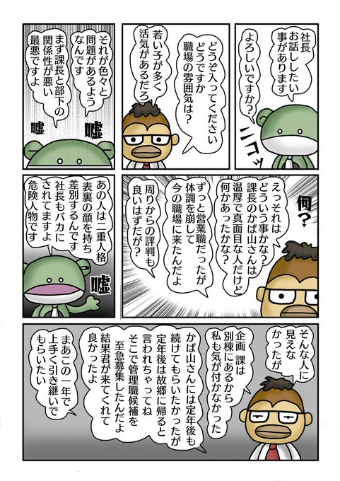
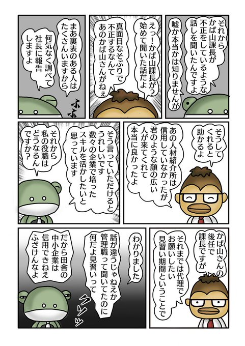
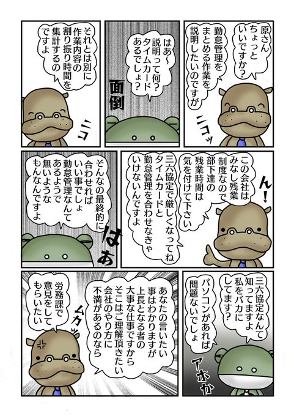

<meta name="twitter:card" content="summary">
<meta name="twitter:title" content="イラスト屋のもけ屋さん">
<meta name="twitter:description" content="第一章　自己愛パワハラ上司がやってきた">
<meta name="twitter:image" content="https://minnanosaiban.github.io/mokeya/_static/logo.png">
<meta property="og:title" content="イラスト屋のもけ屋さん">
<meta property="og:description" content="第一章　自己愛パワハラ上司がやってきた">
<meta property="og:image" content="https://minnanosaiban.github.io/mokeya/_static/logo.png">
<meta property="og:url" content="https://minnanosaiban.github.io/jikoai_01/">


# 第一章　自己愛パワハラ上司がやってきた

`````{margin} 
<i class="fa-brands fa-x-twitter"></i> [20250226-1](https://x.com/uNjQzdmj9c99431/status/1846076058409619923)
<i class="fa-brands fa-x-twitter"></i> [20241015](https://x.com/uNjQzdmj9c99431/status/1846076058409619923)


管理職キャリア対応で<br>
中途入社してきた<br>
原さんは<br>
自己愛性人格障害者<br>
でした😨<br>

人を利用し<br>
のさばる自己愛と<br>
被害を受けた者達の<br>
物語が始まります📗<br>

転職後<br>
かば山課長率いる<br>
企画課に配属された<br>
原さんは<br>
最初の挨拶から<br>
長々と<br>
自慢話をします😳<br>

俺はすごいんだ<br>
アピールは<br>
かえって自分の価値を<br>
下げるのに😩<br>
`````

<div class="base">



</div>

`````{margin} 
<i class="fa-brands fa-x-twitter"></i> [20250226-2](https://x.com/uNjQzdmj9c99431/status/1894634056773767382)
<i class="fa-brands fa-x-twitter"></i> [20241017](https://x.com/uNjQzdmj9c99431/status/1846677753271406820)

原さんの過去の功績<br>
（嘘）話に<br>
興味津々の部下達😳<br>

一人の部下が学歴に<br>
ふれたことから<br>
急に機嫌が<br>
悪くなります😠<br>

自己愛は地雷多し<br>

月野くんは<br>
原さんの地雷に<br>
触れてしまった<br>
ようです😳<br>

マウント意識の強い<br>
自己愛さんは<br>
学歴にこだわる事も<br>
多い気が・・📚<br>
`````

<div class="base">


</div>

`````{margin} 
<i class="fa-brands fa-x-twitter"></i> [20250226-3](https://x.com/uNjQzdmj9c99431/status/1894636430154240278)
<i class="fa-brands fa-x-twitter"></i> [20241018](https://x.com/uNjQzdmj9c99431/status/1847239933456728175)

挨拶と引き継ぎのため<br>
かば山課長は<br>
原さんに同行を<br>
求めますが<br>

な・・なんと拒否❌<br>

引き継ぎは大事なのに<br>

原さんは引き継ぎを<br>
重要視して<br>
いないようです😳<br>

古い考え方だと<br>
文句を言い<br>
下請けを馬鹿にする<br>
こんな人いますよね☹️<br>
`````

<div class="base">



</div>

`````{margin} 
<i class="fa-brands fa-x-twitter"></i> [20250226-4](https://x.com/uNjQzdmj9c99431/status/1894637670443487545)
<i class="fa-brands fa-x-twitter"></i> [20241019](https://x.com/uNjQzdmj9c99431/status/1847632327931023521)

かば山課長に<br>
嫉妬する原さん<br>

すぐに嫉妬するのも<br>
自己愛の特徴なんです<br>

自分より<br>
優れている者は<br>
許せない😤<br>

原さんのパワハラ気質が<br>
顔をのぞかせて<br>
きたようです😳<br>

今回のきっかけは嫉妬<br>
嘘をついて課長を<br>
引きずり下ろそうとする<br>
卑怯な考え方<br>

恐ろしい😱<br>
`````

<div class="base">


</div>

`````{margin} 
<i class="fa-brands fa-x-twitter"></i> [20250226-5](https://x.com/uNjQzdmj9c99431/status/1894638857100124206)
<i class="fa-brands fa-x-twitter"></i> [20241021](https://x.com/uNjQzdmj9c99431/status/1848119741019537782)

原さんは<br>
嘘がばれないよう<br>
口外禁止を<br>
言い渡します！<br>

「他では言わないで」<br>
は自己愛の<br>
危険ワードかも☹️<br>

原さんの魂胆が<br>
目えてきました！<br>

管理職の座に<br>
早く着きたいため<br>
かば課長を陥れようと<br>
嘘の噂を広め😑<br>

部下を集め洗脳<br>
そして切り離しを<br>
仕掛けますが<br>
中途半端な作り話に<br>
部下達は戸惑って<br>
いる様子😳<br>

原さん焦り過ぎ🤐<br>
`````

<div class="base">


</div>

`````{margin} 
<i class="fa-brands fa-x-twitter"></i> [20250226-6](https://x.com/uNjQzdmj9c99431/status/1894640851437195768)
<i class="fa-brands fa-x-twitter"></i> [20241022](https://x.com/uNjQzdmj9c99431/status/1848526369204146278)

口外禁止と言っている<br>
本人が口外してます<br>

自分の存在を<br>
わからせるために<br>
社長に嘘を吹き込む<br>
自己愛<br>

実力も無いのに<br>
「私に任せて下さい」<br>
的な事を言う人は<br>
自己愛かも<br>

そして社長もバカ<br>

何とハラさん<br>
社長に嘘を吹き込みに<br>
いったようです😨<br>

どうやらハラさんは<br>
引き抜きで望まれて<br>
会社に入ったのではなく<br>
小さな転職サイトから<br>
来た人のようでした😳<br>

ただの嘘自慢おじさん<br>
こじらせおじさん<br>
でした😱<br>
`````

<div class="base">



</div>

`````{margin} 
<i class="fa-brands fa-x-twitter"></i> [20250226-7](https://x.com/uNjQzdmj9c99431/status/1894642024852447690)
<i class="fa-brands fa-x-twitter"></i> [20241024](https://x.com/uNjQzdmj9c99431/status/1849233026431197496)

かば山課長にも<br>
不正があったように<br>
告げ口してます😏<br>

無かった事実を<br>
あったようにする<br>
自己愛<br>

出世のためなら<br>
何でもありなんです😏<br>

「嘘か本当かは<br>
　　わからないが」<br>
「聞いた話だけど」<br>
と言って悪い噂を<br>
流す人は疑った方が<br>
いいです😑<br>

バレた時の保身のために<br>
この言葉をつかう<br>
卑怯者です😠<br>
`````

<div class="base">



</div>

`````{margin} 
<i class="fa-brands fa-x-twitter"></i> [20250226-8](https://x.com/uNjQzdmj9c99431/status/1894643446146896333)
<i class="fa-brands fa-x-twitter"></i> [20241025](https://x.com/uNjQzdmj9c99431/status/1849685756757016754)

部下に仕事を<br>
振り分け<br>
時間調整する事は<br>
管理職の大切な<br>
お役目です！<br>

原さんは<br>
労働基準法<br>
認知しているのかな？<br>

勤怠管理は会社によって<br>
異なりますが<br>
管理を疎かにすると<br>
大変な事に😳<br>

管理職の役割として<br>
仕事の割り振りや<br>
長時間労働に<br>
注意が必要ですが<br>

中には理解出来ていない<br>
管理職もいるようです😩<br>

こんな上司の元では<br>
サービス残業が<br>
横行しそうですよね😨<br>
`````

<div class="base">



</div>

`````{margin} 
<i class="fa-brands fa-x-twitter"></i> [20250226-9](https://x.com/uNjQzdmj9c99431/status/1894644473281622038)

原さんは管理職の<br>
経験が無いのでは？<br>
と疑うカバ山課長<br>

知識のない管理職は<br>
部下が苦労するだけ<br>

アホは管理しては<br>
ダメ～❌<br>
`````

<div class="base">


</div>

##