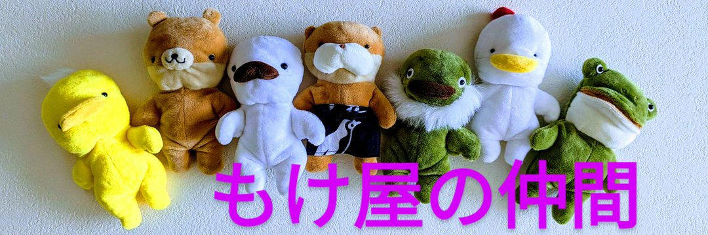
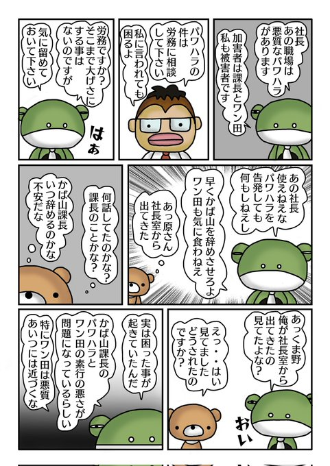
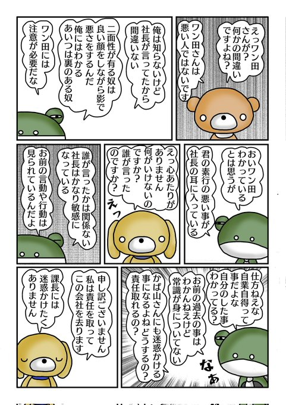
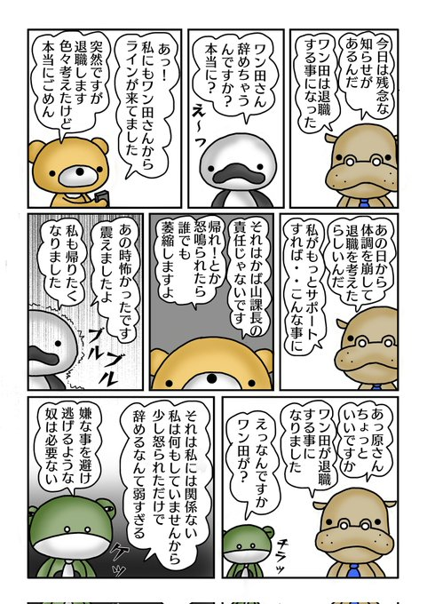
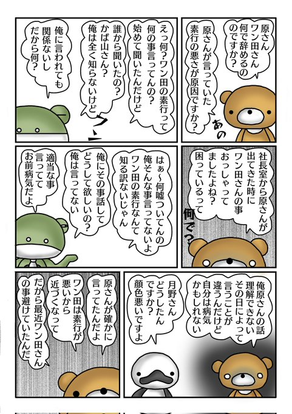
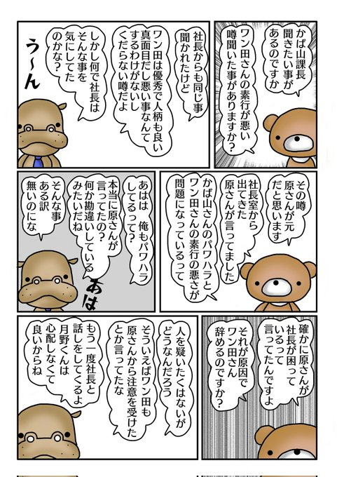
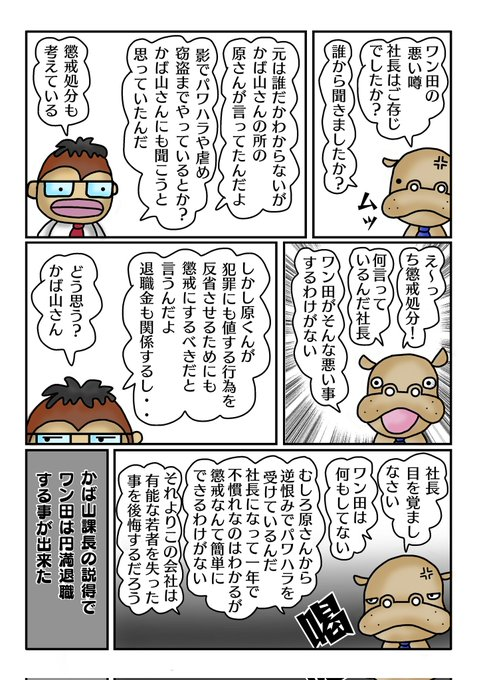
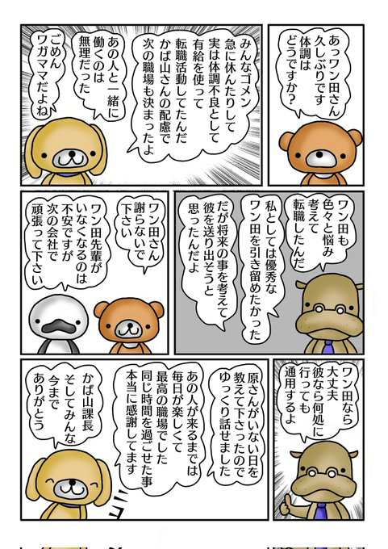

<meta name="twitter:card" content="summary">
<meta name="twitter:title" content="イラスト屋のもけ屋さん">
<meta name="twitter:description" content="第三章　ワン田退職">
<meta name="twitter:image" content="https://minnanosaiban.github.io/mokeya/_static/logo.png">
<meta property="og:title" content="イラスト屋のもけ屋さん">
<meta property="og:description" content="第三章　ワン田退職">
<meta property="og:image" content="https://minnanosaiban.github.io/mokeya/_static/logo.png">
<meta property="og:url" content="https://minnanosaiban.github.io/jikoai_03/">



# 第三章　ワン田退職

`````{margin} 
<i class="fa-brands fa-x-twitter"></i> [20241121](https://x.com/uNjQzdmj9c99431/status/1859493537450184884)

パワ原さんは<br>
社長に嘘の話を持ち込み<br>
助けを求めようと<br>
しましたが・・<br>

面倒な事に<br>
巻き込まれたくない<br>
社長は逃げます😳<br>

会社のトップが<br>
コレでは困ります😑<br>

月野に見られた<br>
パワ原は腹いせに<br>
かば山課長と<br>
ワン田の悪口を🫣<br>
`````

<div class="base">



</div>

`````{margin} 
<i class="fa-brands fa-x-twitter"></i> [20241122](https://x.com/uNjQzdmj9c99431/status/1859835034519351497)

社長に訴えても<br>
聞き入れてもらえ<br>
なかったため腹を立て<br>
直接ワン田を<br>
攻撃するパワ原さん！<br>

「俺は知らないけど<br>
　あの人が言ってた」<br>
と人のせいにして<br>
悪口を言います😨<br>

「◯◯さんが<br>
    迷惑してる」も<br>
自己愛がよく使う言葉😑<br>
`````

<div class="base">



</div>

`````{margin} 
<i class="fa-brands fa-x-twitter"></i> [20241123](https://x.com/uNjQzdmj9c99431/status/1860193483098902858)

ワン田が退職する事を<br>
知ったパワハラさん<br>

何も言っていないのに<br>
私には関係ないと<br>
言いだします😨<br>

自分が関係しているから<br>
逃げるのでは？<br>
思い当たる事が無ければ<br>
逃げる必要は<br>
ありませんからね😑<br>
`````

<div class="base">



</div>

`````{margin} 
<i class="fa-brands fa-x-twitter"></i> [20241124](https://x.com/uNjQzdmj9c99431/status/1860648214732612029)

ワン田の悪い噂を<br>
気にして<br>
発信元のパワ原さんに<br>
確認しようとした月野！<br>

ところがパワ原の<br>
口からは<br>
「俺は知らない」と<br>
嘘つき呼ばわり<br>
されてしまいます😨<br>

自己愛の言う事が<br>
日によって変わる😳<br>

自己愛に有りがちです😑<br>
`````

<div class="base">



</div>

`````{margin} 
<i class="fa-brands fa-x-twitter"></i> [20241125](https://x.com/uNjQzdmj9c99431/status/1860958637415641361)

月野はどうしても<br>
ワン田の事が気になり<br>
かば山課長に<br>
相談しました😑<br>

どうやら社長は<br>
ワン田を疑っている様子<br>
不穏な空気が流れます😨<br>
ワン田は円満に<br>
退職できるので<br>
しょうか？<br>
`````

<div class="base">



</div>

`````{margin} 
<i class="fa-brands fa-x-twitter"></i> [20241126](https://x.com/uNjQzdmj9c99431/status/1861324948113182741)

パワ原さんに<br>
嘘を吹き込まれた<br>
社長は<br>
ワン田の懲戒処分を<br>
検討していました📄<br>

それを知った<br>
かば山さん<br>
温厚な人が部下を<br>
守るため<br>
社長に噛みつきます😡<br>

自己愛が関わると<br>
退職するにも苦労が<br>
あるんですね〜<br>
`````

<div class="base">



</div>

`````{margin} 
<i class="fa-brands fa-x-twitter"></i> [20241127](https://x.com/uNjQzdmj9c99431/status/1861571202281873890)

かば山課長の配慮で<br>
ワン田は退職<br>
そして転職して<br>
いきました😊<br>
ワン田良かったね！<br>

企業は労働問題が<br>
起こると<br>
無かったことにし<br>
大切な人材を失う事を<br>
知ってもらいたい😑<br>
`````

<div class="base">



</div>

##