<meta name="twitter:card" content="summary">
<meta name="twitter:title" content="イラスト屋のもけ屋さん">
<meta name="twitter:description" content="第四章　救急">
<meta name="twitter:image" content="https://minnanosaiban.github.io/mokeya/_static/logo.png">
<meta property="og:title" content="イラスト屋のもけ屋さん">
<meta property="og:description" content="第四章　救急">
<meta property="og:image" content="https://minnanosaiban.github.io/mokeya/_static/logo.png">
<meta property="og:url" content="https://minnanosaiban.github.io/jikoai_04/">


# 第四章　救急

`````{margin} 
<i class="fa-brands fa-x-twitter"></i> [20250105](https://x.com/uNjQzdmj9c99431/status/1875867793796862150)

パワハラを受け<br>
優秀な部下ワン田が<br>
辞めたあと<br>
過労で倒れた<br>
かば山課長😰<br>

パワハラ加害者は<br>
何の責任も感じないの<br>
でしょうね☹️<br>

今回はパワハラの裏側も<br>
描いて行きます！<br>
`````

<div class="base">

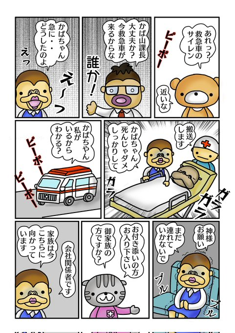

</div>

`````{margin} 
<i class="fa-brands fa-x-twitter"></i> [20250106](https://x.com/uNjQzdmj9c99431/status/1876236002156818900)

かば山課長は<br>
過労で倒れたようですが<br>
ゴリエさんの<br>
不安気な顔<br>
何かありそうですね😨<br>
`````

<div class="base">

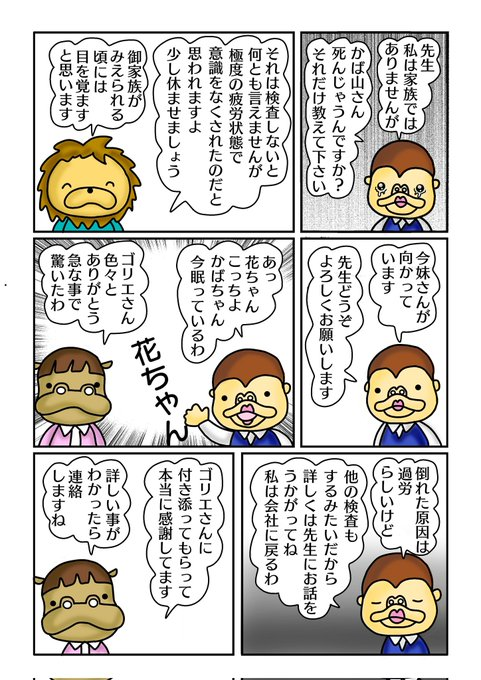

</div>

`````{margin} 
<i class="fa-brands fa-x-twitter"></i> [20250107](https://x.com/uNjQzdmj9c99431/status/1876605390827479121)

かば山課長が倒れた事で<br>
会社は大騒ぎなのに<br>
パワ原さんは<br>
出社していないよう😳<br>

みんなは<br>
何となく違和感を<br>
おぼえているよう☹️<br>

何であの人が来たの？<br>
何で上司なの？<br>
何で選ばれたの？<br>

この何で？？<br>
の違和感は大事です！<br>
`````

<div class="base">

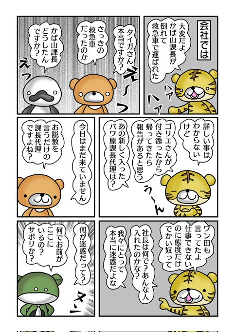

</div>

`````{margin} 
<i class="fa-brands fa-x-twitter"></i> [20250109](https://x.com/uNjQzdmj9c99431/status/1877149161226637757)

今回はとても重要な<br>
ポイントが！<br>
嘘とついている所😏<br>

自己愛は上の者に対して<br>
嘘をつき誠実な<br>
印象を与え<br>
優れた姿を見せます😑<br>

自己愛に対して<br>
全く違う印象を持つ人が<br>
いるのは嘘を<br>
見抜けていないから☹️<br>

コレが自己愛のやり方😱<br>
`````

<div class="base">

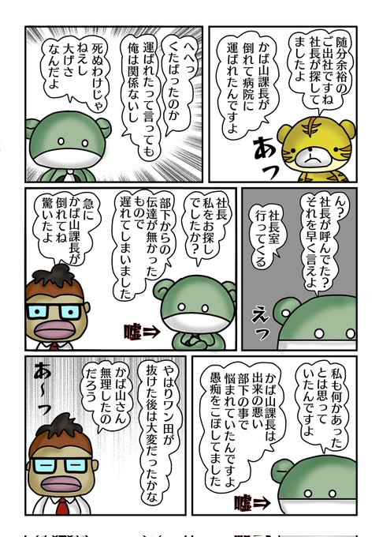

</div>

`````{margin} 
<i class="fa-brands fa-x-twitter"></i> [20250110](https://x.com/uNjQzdmj9c99431/status/1877685305727459713)

社長に取り入るために<br>
ビジネス用語や<br>
カタカナを使って<br>
必死で自分できます<br>
アピールをする<br>
パワ原😨<br>

部下をこき下ろし<br>
悪い印象を与えるのも<br>
得意技😏<br>

中身が無いのに<br>
みっともない😩<br>
`````

<div class="base">

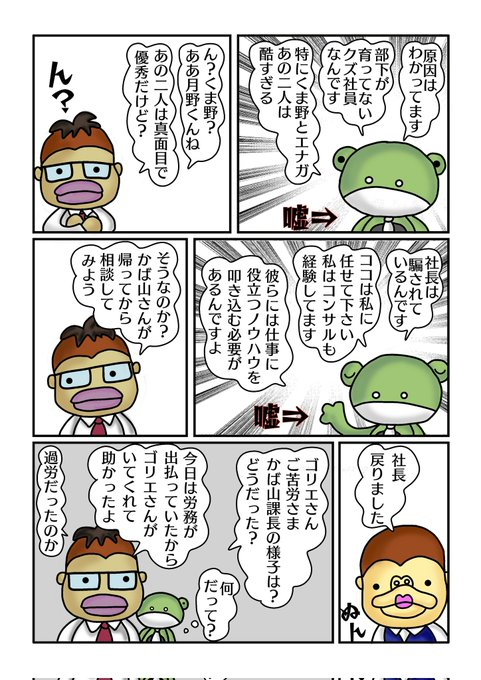

</div>

`````{margin} 
<i class="fa-brands fa-x-twitter"></i> [20250111](https://x.com/uNjQzdmj9c99431/status/1878050607040466977)

自己愛性人格障害者は<br>
他人の不幸が大好き！<br>

人の不幸を栄養源として<br>
自分を認めて貰うため<br>
ここぞと頑張ります😏<br>

このように<br>
自己愛がご機嫌に<br>
なった後は要注意😱<br>
`````

<div class="base">

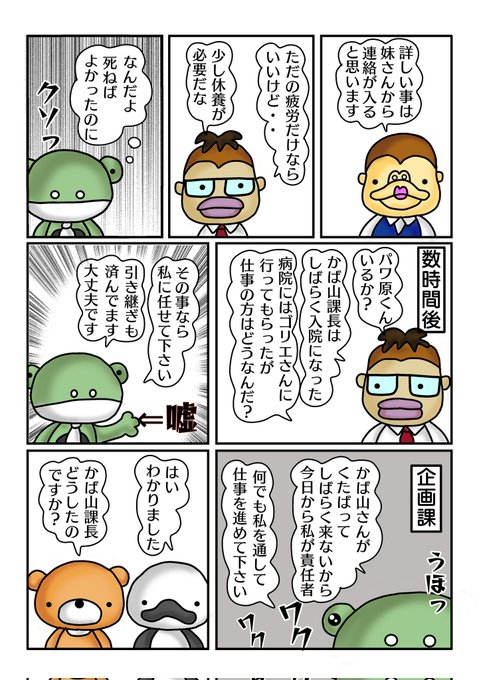

</div>

`````{margin} 
<i class="fa-brands fa-x-twitter"></i> [20250113](https://x.com/uNjQzdmj9c99431/status/1878632456544502211)

かば山課長が・・😭<br>

自己愛と接していると<br>
体調を崩す事が<br>
あります😨<br>

自律神経の乱れから<br>
精神疾患や頭痛<br>
内臓系疾患などの病気<br>
癌を発症した方も<br>
想像以上います😰<br>
何らかの関係性が<br>
あるのでしょうか？<br>

体調がおかしいと<br>
思ったら迷わず受診して<br>
下さい💊<br>
`````

<div class="base">

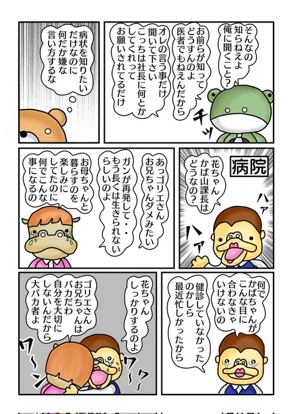

</div>

`````{margin} 
<i class="fa-brands fa-x-twitter"></i> [20250116](https://x.com/uNjQzdmj9c99431/status/1879746141979631784)

急に責任者になった<br>
パワ原課長代理<br>
調子に乗ってます😏<br>

自己愛パワハラ上司が<br>
最初にする事は<br>
マウントを取って<br>
部下を抑えつける事☹️<br>

嘘で部下のやる気<br>
覇気を奪う事から<br>
始めるんです😨<br>
`````

<div class="base">

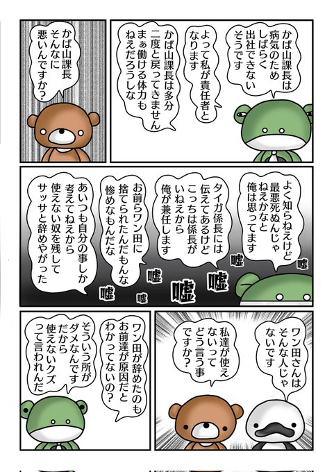

</div>

`````{margin} 
<i class="fa-brands fa-x-twitter"></i> [20250117](https://x.com/uNjQzdmj9c99431/status/1880240929170506052)

パワハラ自己愛上司は<br>
部下の自信を下げます😨<br>

自分の言葉ではなく<br>
社長が言ってる<br>
周りが迷惑していると<br>
嘘で圧をかけて<br>
くるのです☹️<br>

〇〇が言っていると<br>
悪口を言う人は<br>
要注意！<br>
危険人物です🧨<br>
`````

<div class="base">

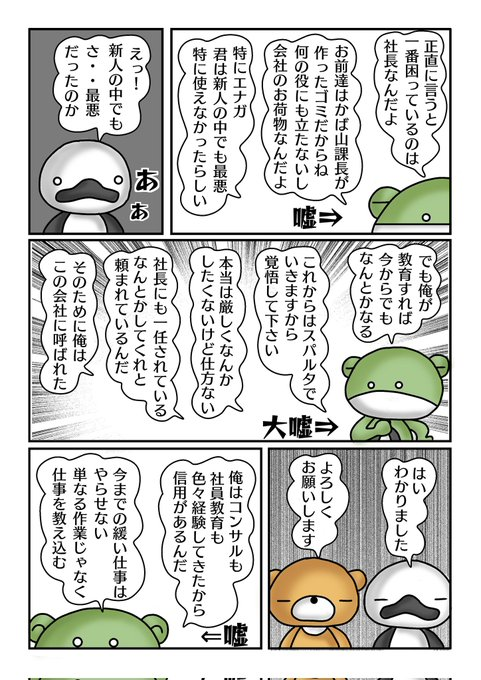

</div>

`````{margin} 
<i class="fa-brands fa-x-twitter"></i> [20250119](https://x.com/uNjQzdmj9c99431/status/1880870837013942628)

やる前に俺に聞け<br>
聞いたら聞いたで<br>
自分で考えろは<br>
自己愛パワハラ上司の<br>
決まり文句です😑<br>

部下達は何を<br>
指示されているのか？<br>
わからない状態で<br>
仕事をしなければ<br>
ならないので<br>
特に新人は苦労します😨<br>

文句だけは一流<br>
指示は下手😨<br>
`````

<div class="base">

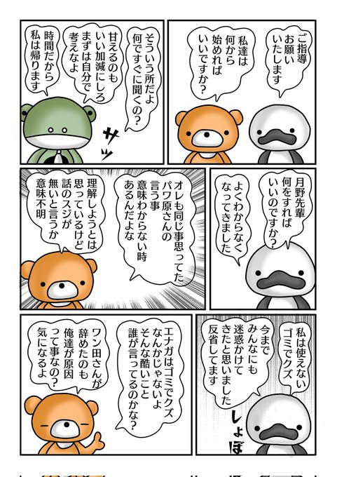

</div>

`````{margin} 
<i class="fa-brands fa-x-twitter"></i> [20250120](https://x.com/uNjQzdmj9c99431/status/1881321846064456078)

朝から機嫌の悪い<br>
パワ原課長代理<br>
言ってないことを<br>
言ったと<br>
言い張ります😳<br>

昨日は何も言わずに<br>
サッサと帰ったのに・・<br>

自分が勘違い<br>
しているのに<br>
部下を責めるのは<br>
本当に困ります😰<br>
`````

<div class="base">

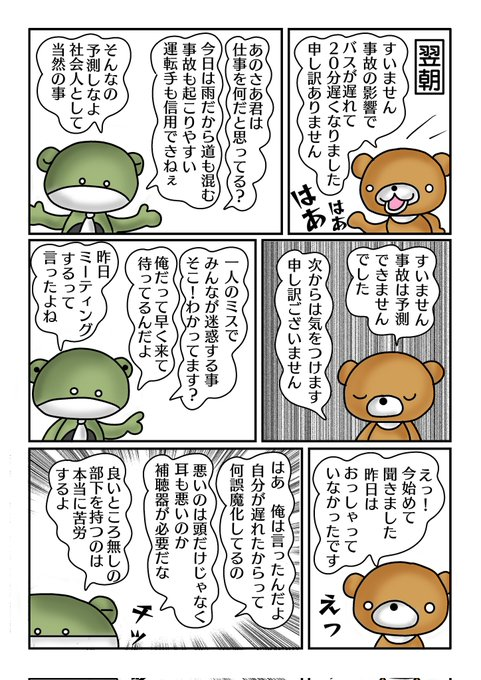

</div>

`````{margin} 
<i class="fa-brands fa-x-twitter"></i> [20250122](https://x.com/uNjQzdmj9c99431/status/1881841041046913235)

自己愛パワハラ上司は<br>
自分の言いたいことが<br>
相手に伝わらないと<br>
バカ・アホ<br>
小学生以下などと言って<br>
屈辱してきます😰<br>

言われた方は<br>
心が折れますが<br>
コレも自己愛言葉です☹️<br>

相手を貶めたい<br>
気持ちが表れて<br>
ますよね！<br>
`````

<div class="base">

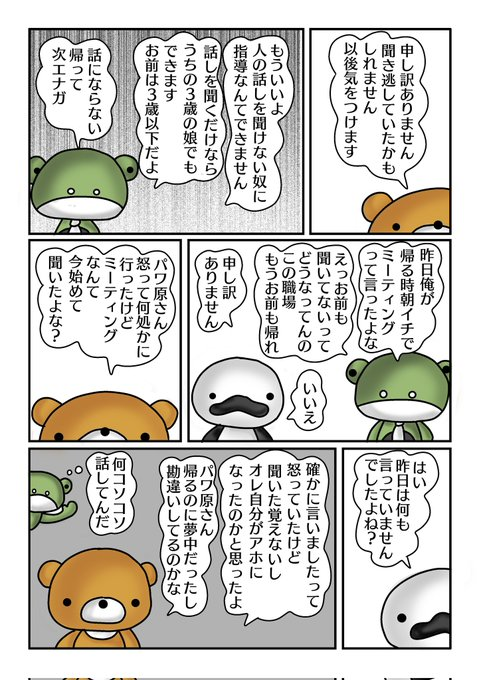

</div>

`````{margin} 
<i class="fa-brands fa-x-twitter"></i> [20250123](https://x.com/uNjQzdmj9c99431/status/1882338794315321825)

自分は良いけど<br>
人はダメ❌<br>

同じ事を<br>
俺は偉いから<br>
やっても良いけど<br>
お前のような下っ端は<br>
やってはいけない❌<br>

コレは常識です！<br>
と言うパワ原😳<br>

自己愛の常識は<br>
被常識ですから😩<br>
`````

<div class="base">

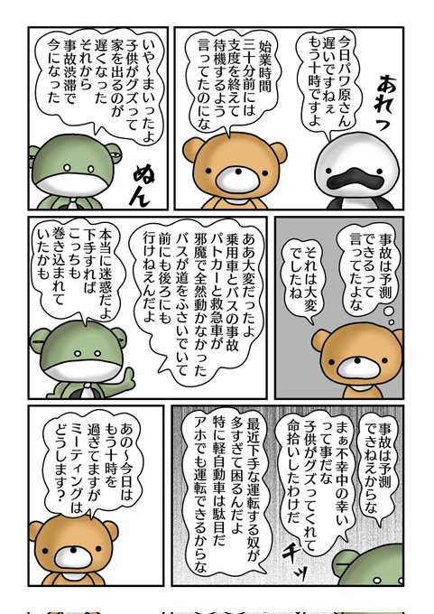

</div>

`````{margin} 
<i class="fa-brands fa-x-twitter"></i> [20250125](https://x.com/uNjQzdmj9c99431/status/1882945643376984155)

自己愛は自分に<br>
落ち度があると<br>
切れます😳<br>
自分は悪くないと<br>
誤魔化すためです😳<br>

それを理不尽な怒り<br>
といいます😩<br>
`````

<div class="base">

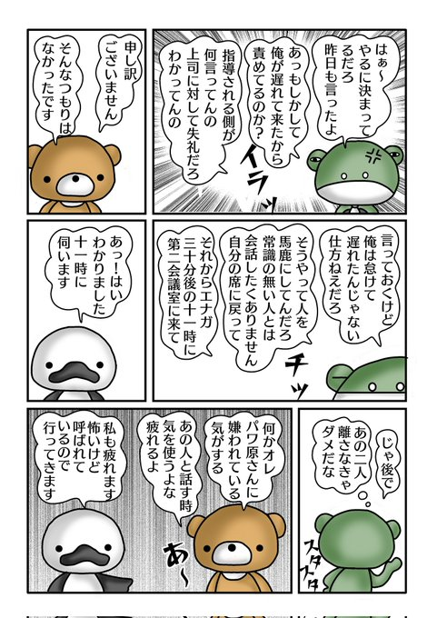

</div>

`````{margin} 
<i class="fa-brands fa-x-twitter"></i> [20250127](https://x.com/uNjQzdmj9c99431/status/1883800660514414880)

個人的にパワ原に<br>
呼ばれたエナガ<br>
悪い予感がします😨<br>

自己愛上司が<br>
機密事項とか<br>
絶対に漏らさないでと<br>
前置きして話す時は<br>
何かを企んでいる時<br>
なんです😏<br>
`````

<div class="base">

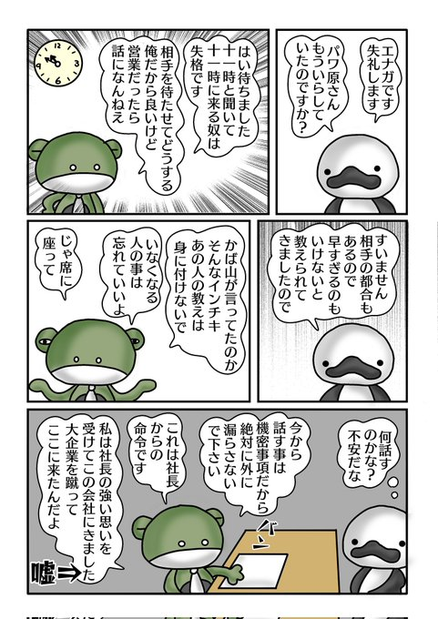

</div>

`````{margin} 
<i class="fa-brands fa-x-twitter"></i> [20250129](https://x.com/uNjQzdmj9c99431/status/1884501144430637400)

部下の中を引き裂く<br>
ために<br>
嘘の悪口を吹き込む<br>
パワハラ上司😨<br>

こうやって悪くない者を<br>
悪者に仕立て上げる<br>
自己愛のやり方は<br>
卑怯すぎる😠<br>
`````

<div class="base">

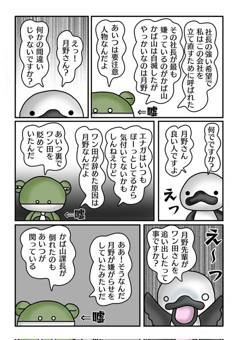

</div>

`````{margin} 
<i class="fa-brands fa-x-twitter"></i> [20250130](https://x.com/uNjQzdmj9c99431/status/1884941201138450920)

世の中には悪い奴が<br>
沢山いるんだ！<br>
と悪い奴が言う事<br>
あると思います😑<br>

エナガのお世話係に<br>
新キャラ登場✨<br>
どうやら<br>
パワ原のお気に入り<br>
のようです😏<br>
`````

<div class="base">

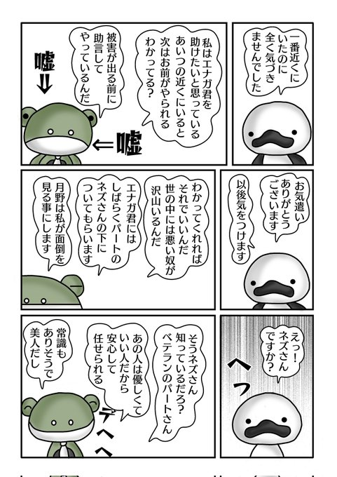

</div>

`````{margin} 
<i class="fa-brands fa-x-twitter"></i> [20250202](https://x.com/uNjQzdmj9c99431/status/1886042483177734629)

パワ原さん<br>
お気に入りの<br>
新キャラのネズさん🐭<br>

見た目は優しそう<br>

でも・・<br>
まだ課長代理なのに<br>
パワ原課長と<br>
呼んでいます😨<br>

ネズさんは敵か味方か？<br>
気になりますよね〜<br>
`````

<div class="base">

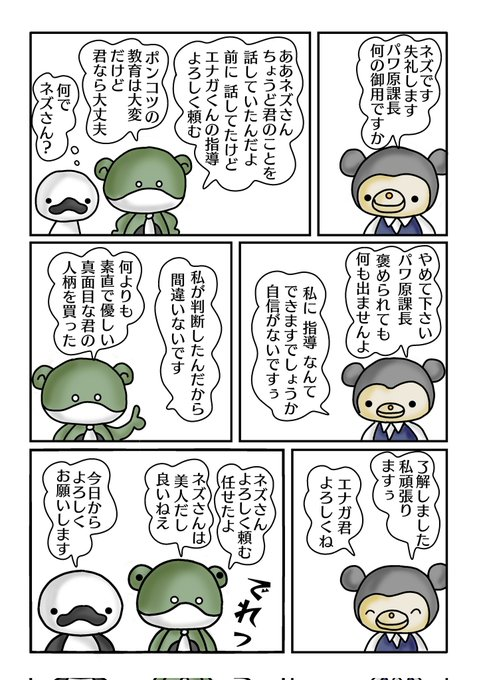

</div>

`````{margin} 
<i class="fa-brands fa-x-twitter"></i> [20250205](https://x.com/uNjQzdmj9c99431/status/1887036936277180917)

従業員と関連企業向けの<br>
飲食割引券に<br>
不正が見つかったため<br>
ゴリエさんが<br>
問い合わせに来ました！<br>

不正主はパワ原<br>
どうやら誤魔化そうと<br>
している様子😳<br>

話のスジが見えてこない<br>
知らないで<br>
とぼける所が<br>
かえって怪しい☹️<br>
`````

<div class="base">

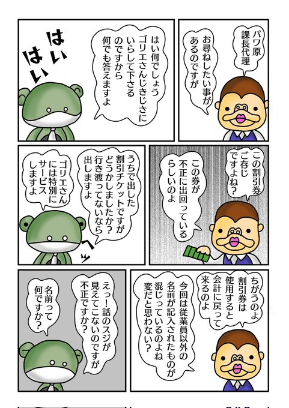

</div>

`````{margin} 
<i class="fa-brands fa-x-twitter"></i> [20250208](https://x.com/uNjQzdmj9c99431/status/1888131156543213993)

割引券を不正に<br>
発行していたのは<br>
パワ原😳<br>
どうやら親戚に<br>
配ったようです🎫<br>

完全にゴリエさんは<br>
疑っていますが<br>
パワ原さんは<br>
人のせいにしようと<br>
しています😨<br>

パワ原さんは<br>
どう回避するの<br>
でしょうか！<br>
`````

<div class="base">

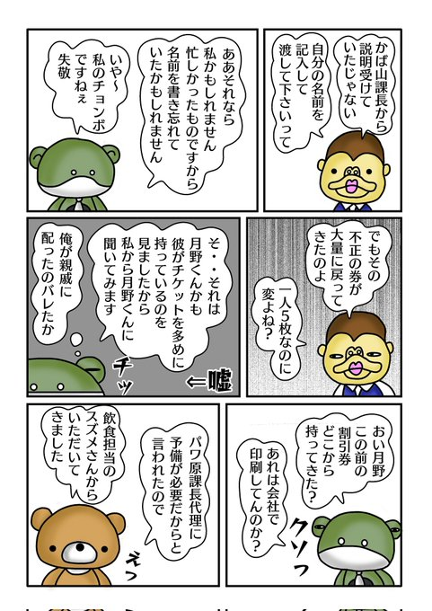

</div>

`````{margin} 
<i class="fa-brands fa-x-twitter"></i> [20250210](https://x.com/uNjQzdmj9c99431/status/1888842459276324950)

パワ原さんは<br>
気の弱そうな<br>
スズメさんに<br>
イチャモンをつけます😨<br>

相手が弱そうだと<br>
断然強気になる<br>
自己愛性人格障害者<br>

人を見て対応を<br>
決めるのです😳<br>
`````

<div class="base">

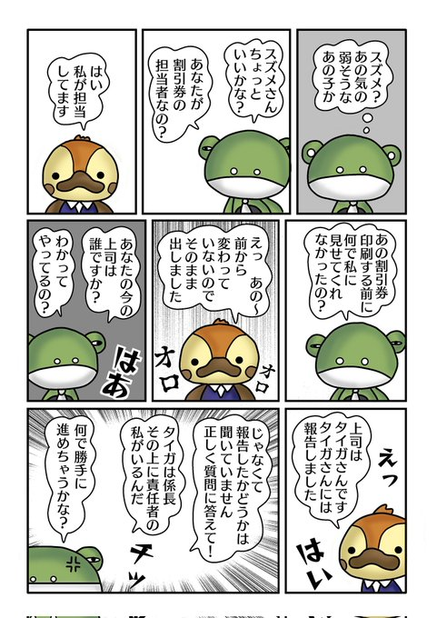

</div>

`````{margin} 
<i class="fa-brands fa-x-twitter"></i> [20250212](https://x.com/uNjQzdmj9c99431/status/1889584033631252687)

不正した者を疑うのは<br>
当然の事！<br>
ゴリエさんの感は<br>
素晴らしい👍<br>

自ら悪い事をして<br>
勘違いされてる<br>
と責任転嫁するのは<br>
自己愛性人格障害者☹️<br>
月野が犠牲に・・<br>

こういう考え方<br>
理解出来ません😳<br>
`````

<div class="base">

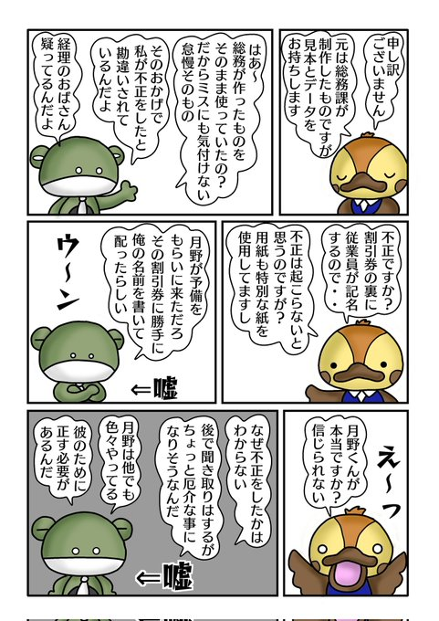

</div>

`````{margin} 
<i class="fa-brands fa-x-twitter"></i> [20250214](https://x.com/uNjQzdmj9c99431/status/1890367637835612222)

スズメに意地悪<br>
しようと意気込んで<br>
きたパワ原の<br>
ほこ先は何故か月野に😨<br>

自己愛は急に話が<br>
急展開したり<br>
横道にそれる事が多い<br>
のも特徴です😳<br>
作り話が多いので<br>
内容がデコボコ<br>
意味がわかりません<br>

スズメさんも理解不能😟<br>
`````

<div class="base">

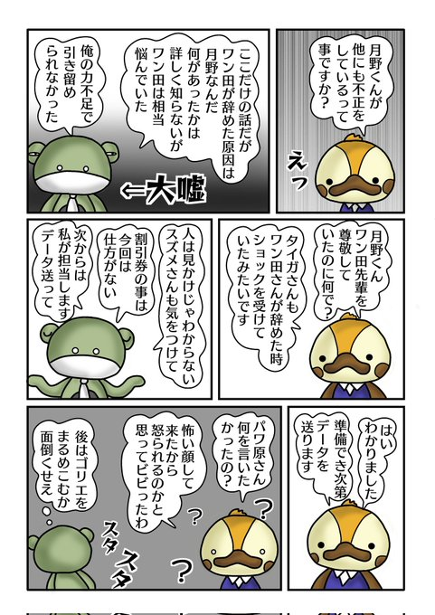

</div>

`````{margin} 
<i class="fa-brands fa-x-twitter"></i> [20250217](https://x.com/uNjQzdmj9c99431/status/1891366131039957495)

月野に不正の罪を<br>
被せようとする<br>
パワ原だが<br>
自分の身内が<br>
やらかしてしまう😳<br>

パワ原さん大ピンチ😱<br>
`````

<div class="base">

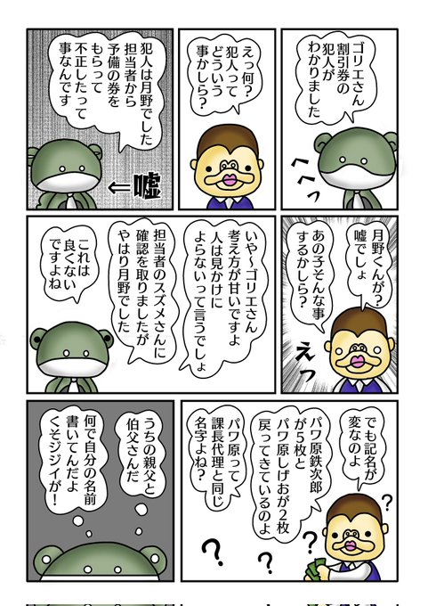

</div>

`````{margin} 
<i class="fa-brands fa-x-twitter"></i> [20250220](https://x.com/uNjQzdmj9c99431/status/1892541978098716884)

嘘がバレそうに<br>
なったパワ原<br>

今思い出しました<br>
からの<br>
部下への責任の<br>
なすりつけ😨<br>

自己愛のよくやる<br>
手口です😳<br>

「自分は悪くない」<br>
を通すために<br>
適当なことを並べて<br>
回避するのです😩<br>
`````

<div class="base">

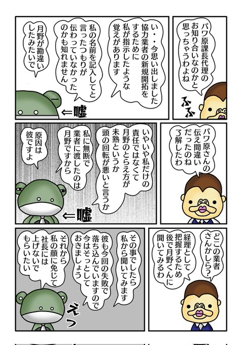

</div>

`````{margin} 
<i class="fa-brands fa-x-twitter"></i> [20250223](https://x.com/uNjQzdmj9c99431/status/1893551055541047456)

嘘つきパワ原は<br>
口外禁止と<br>
言いながら<br>
自分で漏らす😨<br>

悪い事は口止めして<br>
嘘を真実にする<br>
手口を使います😳<br>

自己愛は卑怯者<br>
`````

<div class="base">

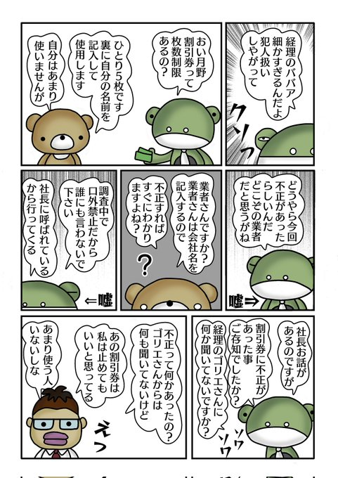

</div>

`````{margin} 
<i class="fa-brands fa-x-twitter"></i> [20250225](https://x.com/uNjQzdmj9c99431/status/1894264905559412966)

社長にわざと嘘を<br>
吹き込むパワ原😨<br>

そこまでして<br>
部下を貶めたい自己愛😩<br>

知らない間に<br>
罪を着せられる事って<br>
あるんです😑<br>
`````

<div class="base">

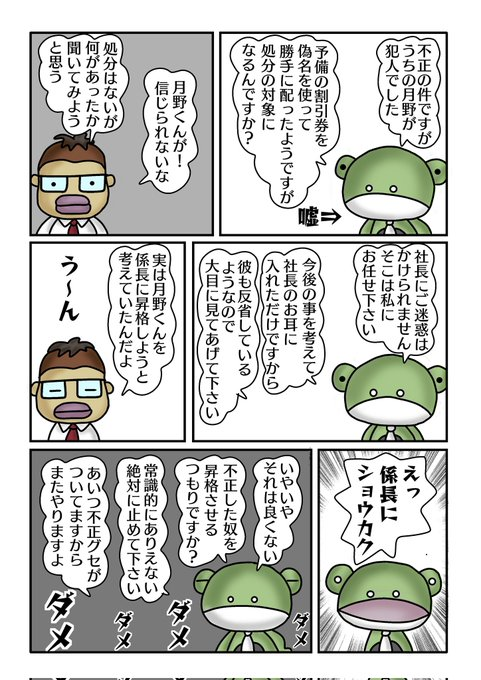

</div>


##